# 浏览器端轻量级视频剪辑与多媒体处理系统需求设计文档

## 一、项目名称

**浏览器端轻量级视频剪辑与多媒体处理系统**

---

## 二、项目背景

随着短视频、网络课程、社交媒体和数字内容创作的发展，视频已经成为人们日常学习、交流和信息传播中的重要多媒体形式。传统的视频剪辑通常依赖专业软件，例如 Premiere、剪映、DaVinci Resolve 等，这类软件虽然功能强大，但安装复杂、学习成本较高，对设备性能也有一定要求。

对于普通用户或学生而言，很多时候只需要完成一些简单的视频处理操作，例如裁剪视频片段、提取音频、生成 GIF、添加水印或使用简单滤镜。如果每次都使用专业剪辑软件，会显得较为繁琐。

因此，本项目计划设计一个轻量级的视频剪辑与多媒体处理系统，使用户能够在浏览器中完成常见的视频处理操作。系统重点关注易用性、轻量化和多媒体处理功能的完整性，适合作为多媒体技术课程的综合实践作品。

---

## 三、项目目标

本项目的目标是实现一个面向普通用户的轻量级视频处理工具。用户可以通过简单的页面操作完成视频上传、视频预览、视频裁剪、GIF 转换、音频提取、添加水印和视频滤镜等功能。

本项目主要目标包括：

1. 实现本地视频文件的上传与预览。
2. 实现对视频指定片段的裁剪。
3. 实现视频片段转换为 GIF 动图。
4. 实现从视频中提取音频。
5. 实现给视频添加文字水印。
6. 实现简单的视频滤镜处理。
7. 实现处理结果的预览与下载。
8. 通过作品体现视频处理、音频处理、图像滤镜、格式转换等多媒体技术内容。

---

## 四、项目定位

本项目定位为一个**轻量级、多功能、易操作的视频处理工具**。

它不是专业级视频剪辑软件，不追求复杂的多轨道剪辑、转场动画、素材管理和专业调色功能，而是面向常见的基础视频处理需求。

### 4.1 项目适用场景

| 使用场景   | 说明                    |
| ------ | --------------------- |
| 学生作业处理 | 对实验视频、课程视频、演示视频进行简单裁剪 |
| 短视频处理  | 快速截取视频片段，生成短视频素材      |
| GIF 制作 | 将视频中的某个片段转换为 GIF 动图   |
| 音频提取   | 从视频中提取背景音乐、讲解声音或录音    |
| 视频标识   | 给视频添加姓名、学号、课程名称等文字水印  |
| 视频效果处理 | 给视频添加黑白、模糊、亮度调整等基础滤镜  |

### 4.2 项目功能边界

本项目主要处理单个视频文件，不涉及复杂的视频工程管理。

暂不包含以下功能：

1. 用户登录与注册。
2. 数据库存储。
3. 云端视频保存。
4. 多视频拼接。
5. 多轨道时间轴编辑。
6. 复杂字幕轨道。
7. 转场动画。
8. 专业级调色。
9. 多人协作编辑。
10. 在线视频平台播放管理。

---

## 五、用户需求分析

## 5.1 目标用户

本系统主要面向以下用户：

| 用户类型   | 需求说明                  |
| ------ | --------------------- |
| 学生     | 希望快速处理课程作业视频、实验演示视频   |
| 普通用户   | 希望不安装专业软件也能完成简单视频处理   |
| 内容创作者  | 希望快速裁剪短视频、添加水印、生成 GIF |
| 教学演示人员 | 希望通过作品展示视频处理和多媒体技术应用  |

---

## 5.2 用户核心需求

用户的核心需求可以概括为以下几个方面：

1. **简单上传视频**
   用户能够从本地选择视频文件，并在页面中加载。

2. **直接预览视频**
   用户上传视频后，可以立即播放、暂停和查看视频内容。

3. **快速裁剪视频**
   用户可以设置开始时间和结束时间，截取自己需要的视频片段。

4. **生成 GIF 动图**
   用户可以将视频中的某个片段转换为 GIF，方便用于展示或分享。

5. **提取视频音频**
   用户可以从视频中提取声音部分，单独保存为音频文件。

6. **添加文字水印**
   用户可以在视频上添加自定义文字，例如姓名、学号、作品名称等。

7. **添加简单滤镜**
   用户可以对视频画面进行基础美化或风格化处理。

8. **下载处理结果**
   用户完成处理后，可以将生成的视频、GIF 或音频文件下载到本地。

---

## 六、系统功能结构

系统整体功能可以分为以下几个模块：

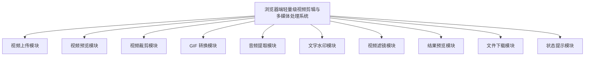

---

# 七、功能需求设计

## 7.1 视频上传模块

### 7.1.1 功能描述

视频上传模块用于接收用户选择的本地视频文件。用户点击上传按钮后，可以从本地文件夹中选择视频文件，系统读取该文件并展示基础信息。

### 7.1.2 功能需求

1. 用户可以点击按钮选择本地视频文件。
2. 系统支持常见视频格式，例如 MP4、WebM、MOV 等。
3. 上传成功后，系统显示视频文件名称。
4. 上传成功后，系统显示视频文件大小。
5. 上传成功后，系统显示视频文件格式。
6. 上传成功后，系统自动生成视频预览。
7. 如果用户上传的不是视频文件，系统应给出提示。
8. 如果视频文件过大，系统应提示用户选择较小的视频文件。
9. 用户可以重新选择其他视频文件。
10. 重新上传视频后，原有处理结果应被清空，避免结果混乱。

### 7.1.3 页面内容

| 页面元素 | 说明            |
| ---- | ------------- |
| 上传按钮 | 用于选择本地视频      |
| 文件名称 | 显示当前视频名称      |
| 文件大小 | 显示视频大小        |
| 文件格式 | 显示视频类型        |
| 提示信息 | 显示上传成功或上传失败原因 |

---

## 7.2 视频预览模块

### 7.2.1 功能描述

视频预览模块用于播放用户上传的视频，让用户能够在处理前查看视频内容，并确定需要裁剪的时间范围。

### 7.2.2 功能需求

1. 视频上传成功后，系统自动显示视频播放器。
2. 用户可以播放视频。
3. 用户可以暂停视频。
4. 用户可以拖动视频进度条。
5. 用户可以查看当前播放时间。
6. 用户可以查看视频总时长。
7. 用户可以通过预览确定裁剪起点和终点。
8. 用户可以全屏播放视频。
9. 视频播放失败时，系统应提示视频格式可能不受支持。
10. 切换视频文件后，预览内容应同步更新。

### 7.2.3 页面内容

| 页面元素   | 说明           |
| ------ | ------------ |
| 视频播放器  | 用于播放上传的视频    |
| 当前播放时间 | 显示当前播放到的位置   |
| 视频总时长  | 显示视频完整时长     |
| 播放控制区  | 播放、暂停、进度条、全屏 |

---

## 7.3 视频裁剪模块

### 7.3.1 功能描述

视频裁剪模块是系统的核心功能之一。用户可以输入或选择视频的开始时间和结束时间，系统根据该时间范围截取视频片段，并生成新的视频文件。

### 7.3.2 功能需求

1. 用户可以设置裁剪开始时间。
2. 用户可以设置裁剪结束时间。
3. 开始时间不能小于 0。
4. 结束时间不能超过视频总时长。
5. 开始时间必须小于结束时间。
6. 用户点击“裁剪视频”后，系统开始处理视频。
7. 处理过程中，系统显示“正在裁剪视频”等状态提示。
8. 裁剪完成后，系统生成新的视频文件。
9. 裁剪完成后，用户可以预览裁剪结果。
10. 裁剪完成后，用户可以下载裁剪后的视频。
11. 用户可以修改时间范围并重新裁剪。
12. 如果时间输入不合法，系统应给出明确提示。

### 7.3.3 输入内容

| 输入项  | 说明          |
| ---- | ----------- |
| 原始视频 | 用户上传的视频文件   |
| 开始时间 | 需要裁剪片段的起始位置 |
| 结束时间 | 需要裁剪片段的结束位置 |

### 7.3.4 输出内容

| 输出项   | 说明           |
| ----- | ------------ |
| 裁剪后视频 | 根据时间范围生成的新视频 |
| 视频预览  | 用户可以播放查看裁剪结果 |
| 下载按钮  | 用户可以下载处理后视频  |

### 7.3.5 示例流程

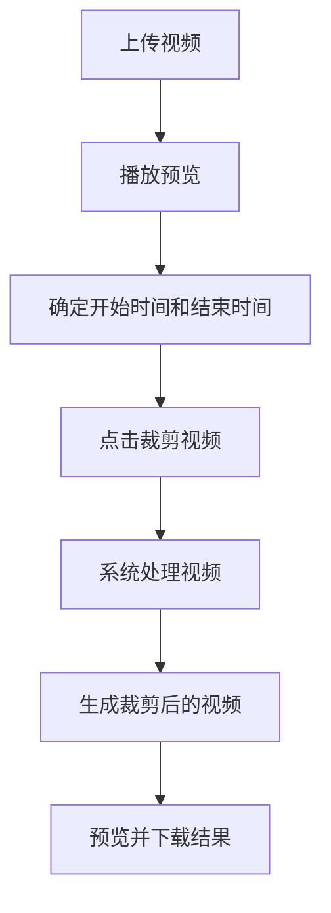

---

## 7.4 GIF 转换模块

### 7.4.1 功能描述

GIF 转换模块用于将视频中的某一段转换为 GIF 动图。该功能适合用于制作表情包、动态展示图或课程演示素材。

### 7.4.2 功能需求

1. 用户可以选择需要转换的起始时间。
2. 用户可以设置 GIF 持续时间。
3. 用户可以选择 GIF 的画面宽度。
4. 用户可以选择 GIF 的帧率。
5. 系统根据用户设置生成 GIF 动图。
6. GIF 转换过程中，系统显示处理状态。
7. 转换完成后，系统显示 GIF 预览。
8. 用户可以下载生成的 GIF 文件。
9. 如果设置的 GIF 时长过长，系统应提示文件可能较大。
10. 如果转换失败，系统应提示用户重新设置参数。

### 7.4.3 输入内容

| 输入项  | 说明        |
| ---- | --------- |
| 原始视频 | 用户上传的视频   |
| 起始时间 | GIF 开始位置  |
| 持续时间 | GIF 截取长度  |
| 帧率   | 每秒显示的图片帧数 |
| 画面宽度 | GIF 输出尺寸  |

### 7.4.4 输出内容

| 输出项    | 说明          |
| ------ | ----------- |
| GIF 文件 | 转换后的动图文件    |
| GIF 预览 | 页面中直接显示 GIF |
| 下载按钮   | 下载 GIF 到本地  |

### 7.4.5 示例流程

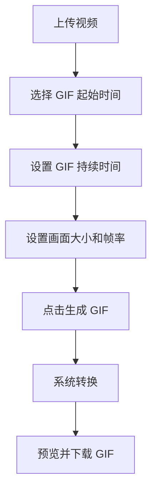

---

## 7.5 音频提取模块

### 7.5.1 功能描述

音频提取模块用于从视频文件中分离出音频内容，并将其保存为单独的音频文件。该功能适合用于提取背景音乐、人物讲话、课程讲解音频等。

### 7.5.2 功能需求

1. 用户上传视频后，可以点击“提取音频”。
2. 系统从视频中分离音频轨道。
3. 提取过程中，系统显示处理状态。
4. 音频提取完成后，系统生成音频文件。
5. 用户可以播放提取后的音频。
6. 用户可以下载提取后的音频文件。
7. 如果视频文件没有音频轨道，系统应提示用户当前视频不包含音频。
8. 用户可以重新上传视频并再次提取。

### 7.5.3 输入内容

| 输入项  | 说明                  |
| ---- | ------------------- |
| 原始视频 | 包含音频的视频文件           |
| 输出格式 | 音频保存格式，例如 MP3 或 WAV |

### 7.5.4 输出内容

| 输出项  | 说明         |
| ---- | ---------- |
| 音频文件 | 从视频中提取出的音频 |
| 音频预览 | 页面中播放音频    |
| 下载按钮 | 下载音频文件     |

### 7.5.5 示例流程

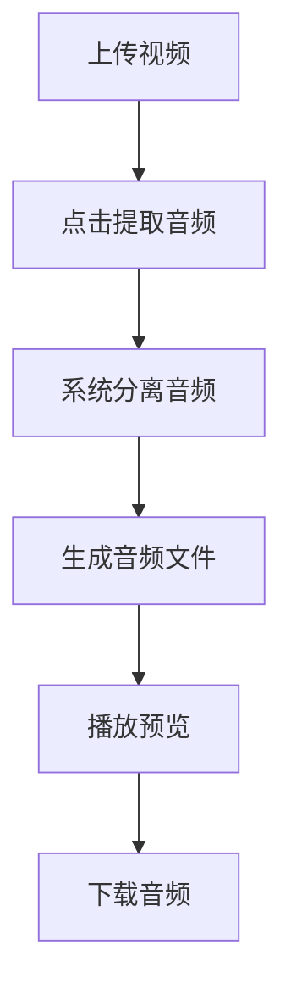

---

## 7.6 文字水印模块

### 7.6.1 功能描述

文字水印模块用于在视频画面上添加自定义文字。用户可以输入水印内容，并设置水印的位置、字体大小和颜色。

### 7.6.2 功能需求

1. 用户可以输入自定义水印文字。
2. 用户可以设置水印字体大小。
3. 用户可以选择水印文字颜色。
4. 用户可以选择水印显示位置。
5. 水印位置支持左上角、右上角、左下角、右下角、居中等。
6. 用户点击“添加水印”后，系统生成带水印的视频。
7. 处理过程中，系统显示处理状态。
8. 处理完成后，用户可以预览带水印的视频。
9. 用户可以下载带水印的视频。
10. 如果用户未输入水印内容，系统应提示用户输入文字。
11. 水印内容应避免过长，过长时系统应提示用户适当缩短。

### 7.6.3 输入内容

| 输入项  | 说明       |
| ---- | -------- |
| 原始视频 | 用户上传的视频  |
| 水印文字 | 用户自定义输入  |
| 字体大小 | 控制文字大小   |
| 文字颜色 | 控制水印颜色   |
| 水印位置 | 控制水印显示区域 |

### 7.6.4 输出内容

| 输出项   | 说明         |
| ----- | ---------- |
| 带水印视频 | 添加文字水印后的视频 |
| 视频预览  | 预览水印效果     |
| 下载按钮  | 下载带水印视频    |

### 7.6.5 示例流程

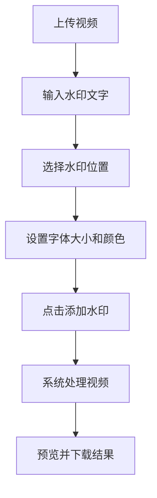

---

## 7.7 视频滤镜模块

### 7.7.1 功能描述

视频滤镜模块用于对视频画面进行简单的图像效果处理，使视频具有不同的视觉风格。

### 7.7.2 支持滤镜类型

| 滤镜类型  | 功能说明         |
| ----- | ------------ |
| 黑白滤镜  | 将视频画面转换为灰度效果 |
| 模糊滤镜  | 对视频画面进行模糊处理  |
| 亮度增强  | 提高视频画面的整体亮度  |
| 亮度降低  | 降低视频画面的整体亮度  |
| 对比度增强 | 增强画面明暗对比     |
| 镜像翻转  | 将视频画面进行水平翻转  |
| 复古效果  | 让视频画面呈现偏旧的色调 |
| 冷色调   | 让视频画面偏蓝、偏冷   |
| 暖色调   | 让视频画面偏黄、偏暖   |

### 7.7.3 功能需求

1. 用户可以从滤镜列表中选择一种滤镜。
2. 用户可以预览滤镜名称和效果说明。
3. 用户点击“应用滤镜”后，系统开始处理视频。
4. 处理过程中，系统显示处理状态。
5. 滤镜处理完成后，系统生成新视频。
6. 用户可以预览滤镜处理后的视频。
7. 用户可以下载滤镜处理后的视频。
8. 用户可以重新选择其他滤镜进行处理。
9. 用户未选择滤镜时，系统应提示用户先选择滤镜。
10. 滤镜处理不覆盖原始视频，用户仍然可以重新处理原视频。

### 7.7.4 输入内容

| 输入项  | 说明        |
| ---- | --------- |
| 原始视频 | 用户上传的视频   |
| 滤镜类型 | 用户选择的视频效果 |

### 7.7.5 输出内容

| 输出项  | 说明        |
| ---- | --------- |
| 滤镜视频 | 应用滤镜后的新视频 |
| 视频预览 | 预览滤镜效果    |
| 下载按钮 | 下载处理结果    |

### 7.7.6 示例流程

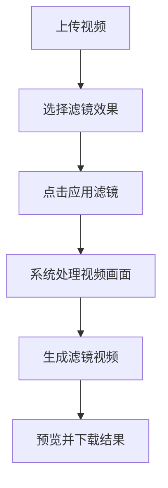

---

## 7.8 视频封面截取模块

### 7.8.1 功能描述

视频封面截取模块用于从视频中截取指定时间点的一帧画面，并将其保存为图片。该功能可以用于生成视频封面、课程展示图或作业截图。

### 7.8.2 功能需求

1. 用户可以选择视频中的某一个时间点。
2. 用户点击“截取封面”后，系统截取该时间点的画面。
3. 系统生成图片文件。
4. 用户可以预览截取出的封面图片。
5. 用户可以下载封面图片。
6. 如果时间点超过视频时长，系统应提示用户重新选择。
7. 用户可以多次截取不同时间点的封面。

### 7.8.3 输入内容

| 输入项   | 说明          |
| ----- | ----------- |
| 原始视频  | 用户上传的视频     |
| 截图时间点 | 需要截取画面的时间位置 |

### 7.8.4 输出内容

| 输出项  | 说明         |
| ---- | ---------- |
| 封面图片 | 从视频中截取出的图片 |
| 图片预览 | 页面中显示截图结果  |
| 下载按钮 | 下载封面图片     |

---

## 7.9 结果预览模块

### 7.9.1 功能描述

结果预览模块用于展示系统处理后的结果，包括裁剪后的视频、GIF 动图、提取出的音频、带水印的视频、滤镜视频和封面图片等。

### 7.9.2 功能需求

1. 处理完成后，系统自动显示结果预览区域。
2. 如果结果是视频，系统显示视频播放器。
3. 如果结果是 GIF，系统显示 GIF 动图。
4. 如果结果是音频，系统显示音频播放器。
5. 如果结果是图片，系统显示图片预览。
6. 用户可以查看处理结果是否符合预期。
7. 用户可以重新调整参数并再次处理。
8. 新的处理结果生成后，预览区域应同步更新。
9. 系统应区分不同类型的处理结果，避免显示混乱。

### 7.9.3 结果类型

| 结果类型 | 预览方式    |
| ---- | ------- |
| 视频   | 视频播放器预览 |
| GIF  | 图片方式预览  |
| 音频   | 音频播放器预览 |
| 图片   | 图片预览    |

---

## 7.10 文件下载模块

### 7.10.1 功能描述

文件下载模块用于将系统处理后的结果保存到用户本地。

### 7.10.2 功能需求

1. 处理完成后，系统显示下载按钮。
2. 用户点击下载按钮后，可以保存处理结果。
3. 不同功能生成的文件应使用不同的默认文件名。
4. 裁剪后视频可以命名为 `clip-video.mp4`。
5. GIF 文件可以命名为 `output.gif`。
6. 音频文件可以命名为 `audio.mp3`。
7. 水印视频可以命名为 `watermark-video.mp4`。
8. 滤镜视频可以命名为 `filter-video.mp4`。
9. 封面图片可以命名为 `cover.png`。
10. 如果没有生成结果，下载按钮不应显示或应处于不可点击状态。

---

## 7.11 状态提示模块

### 7.11.1 功能描述

状态提示模块用于向用户展示当前系统状态，包括未上传、上传成功、正在处理、处理完成和处理失败等。

### 7.11.2 状态类型

| 状态   | 说明               |
| ---- | ---------------- |
| 等待上传 | 用户尚未选择视频         |
| 上传成功 | 视频文件已经成功加载       |
| 参数错误 | 用户输入的时间、文字或设置不合法 |
| 正在处理 | 系统正在进行视频处理       |
| 处理完成 | 已经生成处理结果         |
| 处理失败 | 处理过程中出现错误        |
| 等待下载 | 处理完成，可以下载结果      |

### 7.11.3 功能需求

1. 用户未上传视频时，系统提示“请先上传视频”。
2. 视频上传成功后，系统提示“视频上传成功”。
3. 用户输入参数错误时，系统提示具体错误原因。
4. 视频处理过程中，系统提示“正在处理，请稍候”。
5. 处理完成后，系统提示“处理完成，可以预览或下载”。
6. 处理失败后，系统提示“处理失败，请重新尝试”。
7. 处理过程中，应避免用户重复点击处理按钮。
8. 状态提示内容应简单明确。

---

# 八、页面功能设计

## 8.1 页面整体结构

系统页面可以分为以下几个主要区域：

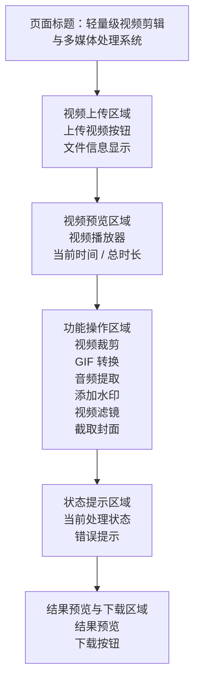

---

## 8.2 首页展示内容

首页进入后，默认显示：

1. 系统名称。
2. 系统简介。
3. 上传视频按钮。
4. 支持功能说明。
5. 使用提示。

示例说明：

```text
请选择一个本地视频文件，上传后可进行裁剪、转 GIF、提取音频、添加水印、应用滤镜和截取封面等操作。
```

---

## 8.3 功能操作区设计

功能操作区可以采用分组方式展示，每个功能单独放在一个区域中，避免用户操作混乱。

### 视频裁剪区域

| 控件      | 说明       |
| ------- | -------- |
| 开始时间输入框 | 输入裁剪开始时间 |
| 结束时间输入框 | 输入裁剪结束时间 |
| 裁剪按钮    | 开始裁剪视频   |

### GIF 转换区域

| 控件        | 说明          |
| --------- | ----------- |
| 起始时间输入框   | GIF 开始位置    |
| 持续时间输入框   | GIF 时长      |
| 帧率选择      | 控制 GIF 流畅程度 |
| 宽度选择      | 控制 GIF 画面大小 |
| 生成 GIF 按钮 | 开始转换        |

### 音频提取区域

| 控件     | 说明           |
| ------ | ------------ |
| 输出格式选择 | 选择 MP3 或 WAV |
| 提取音频按钮 | 开始提取音频       |

### 文字水印区域

| 控件      | 说明       |
| ------- | -------- |
| 水印文字输入框 | 输入文字内容   |
| 字体大小输入框 | 设置文字大小   |
| 颜色选择    | 设置文字颜色   |
| 位置选择    | 选择水印显示位置 |
| 添加水印按钮  | 开始处理     |

### 视频滤镜区域

| 控件     | 说明       |
| ------ | -------- |
| 滤镜选择框  | 选择滤镜效果   |
| 滤镜说明   | 显示当前滤镜效果 |
| 应用滤镜按钮 | 开始处理     |

### 封面截取区域

| 控件      | 说明         |
| ------- | ---------- |
| 截图时间输入框 | 输入需要截图的时间点 |
| 截取封面按钮  | 生成封面图片     |

---

# 九、核心业务流程设计

## 9.1 整体业务流程

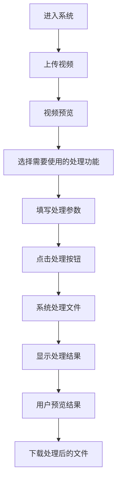

---

## 9.2 视频裁剪流程

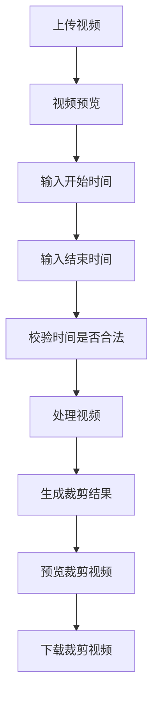

---

## 9.3 GIF 转换流程

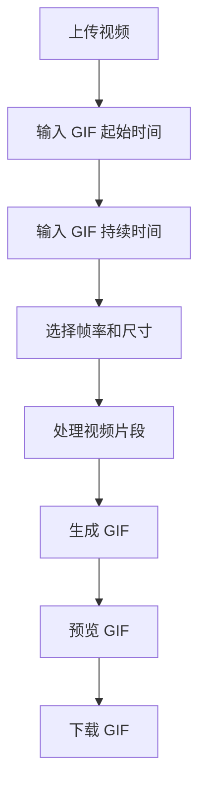

---

## 9.4 音频提取流程

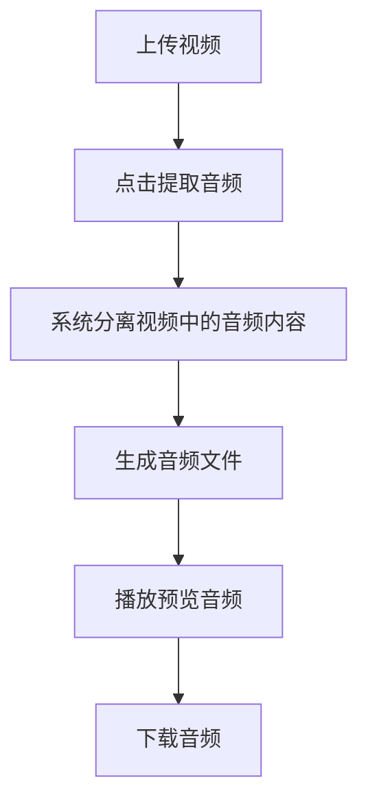

---

## 9.5 添加水印流程

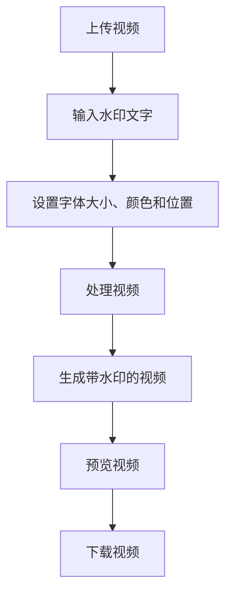

---

## 9.6 应用滤镜流程

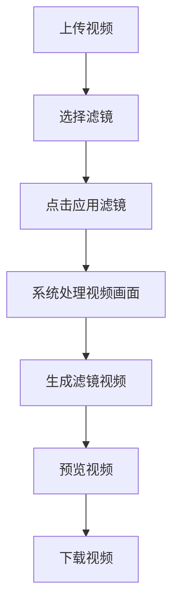

---

# 十、功能优先级设计

为了保证项目可以顺利完成，可以将功能分为核心功能和扩展功能。

## 10.1 核心功能

核心功能是作品必须重点完成的部分。

| 功能     | 说明               |
| ------ | ---------------- |
| 视频上传   | 用户可以选择本地视频       |
| 视频预览   | 用户可以播放上传的视频      |
| 视频裁剪   | 用户可以截取指定时间段的视频   |
| GIF 转换 | 用户可以将视频片段转换为 GIF |
| 结果下载   | 用户可以下载处理后的文件     |
| 状态提示   | 用户可以知道当前处理状态     |

---

## 10.2 扩展功能

扩展功能用于提升作品完整度和展示效果。

| 功能     | 说明               |
| ------ | ---------------- |
| 音频提取   | 从视频中提取声音         |
| 文字水印   | 给视频添加自定义水印       |
| 视频滤镜   | 给视频添加黑白、模糊、亮度等效果 |
| 封面截取   | 从视频中截取指定画面       |
| 结果预览   | 对处理后的结果进行预览      |
| 文件信息展示 | 显示文件名、大小、时长等信息   |

---

# 十一、功能之间的关系

系统中各功能之间的关系如下：

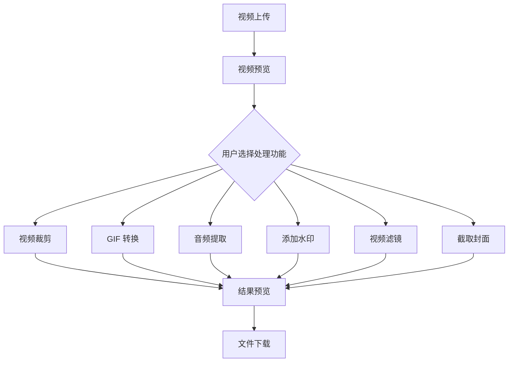

其中，**视频上传和视频预览是基础功能**，其他处理功能都依赖于用户已经上传视频。

---

# 十二、错误提示设计

系统需要对用户的错误操作进行提示，避免用户不知道问题原因。

| 错误情况       | 提示内容              |
| ---------- | ----------------- |
| 未上传视频就点击处理 | 请先上传视频文件          |
| 上传文件不是视频   | 当前文件格式不支持，请上传视频文件 |
| 视频文件过大     | 视频文件较大，可能导致处理时间过长 |
| 开始时间为空     | 请输入开始时间           |
| 结束时间为空     | 请输入结束时间           |
| 开始时间大于结束时间 | 开始时间必须小于结束时间      |
| 时间超过视频总时长  | 输入时间不能超过视频总时长     |
| 水印文字为空     | 请输入水印文字           |
| 未选择滤镜      | 请先选择滤镜效果          |
| 处理失败       | 处理失败，请检查参数后重试     |
| 下载失败       | 文件生成失败，暂时无法下载     |

---

# 十三、系统特色

本系统的特色主要体现在以下几个方面：

1. **功能轻量但完整**
   系统不追求专业剪辑软件的复杂功能，而是聚焦于常见的视频处理需求。

2. **操作简单**
   用户只需要上传视频、选择功能、填写参数、点击处理，即可得到结果。

3. **多种多媒体处理能力结合**
   系统不仅支持视频裁剪，还支持 GIF 转换、音频提取、文字水印、视频滤镜和封面截取。

4. **适合作品展示**
   每个功能都有明确的输入和输出，方便在课堂或答辩中进行演示。

5. **体现多媒体课程内容**
   项目涉及视频、音频、图像和动画等多种多媒体形式，符合多媒体技术课程要求。

---

# 十四、预期功能效果

项目完成后，用户可以完成以下操作：

1. 上传一个本地视频文件。
2. 在页面中播放和预览视频。
3. 选择开始时间和结束时间，裁剪出视频片段。
4. 将视频片段转换为 GIF 动图。
5. 从视频中提取音频。
6. 给视频添加文字水印。
7. 给视频添加简单滤镜。
8. 从视频中截取封面图片。
9. 预览系统生成的处理结果。
10. 下载处理后的文件。

---

# 十五、总结

本项目设计的是一个浏览器端轻量级视频剪辑与多媒体处理系统，主要面向基础视频处理需求。系统围绕视频上传、视频预览、视频裁剪、GIF 转换、音频提取、文字水印、视频滤镜、封面截取和结果下载等功能展开。

与普通视频播放器相比，本系统不仅能够播放视频，还能够对视频内容进行处理和导出，功能更加丰富，也更能体现多媒体技术课程的综合应用价值。与专业视频剪辑软件相比，本系统更加轻量，操作流程更简单，适合作为课程期末作品进行开发和展示。
